# Hi, I'm Ross 👋

I design and automate AWS environments that are secure by default and boring to operate.
Most of my work lives at the intersection of **multi-account AWS architecture**, **infrastructure as code**, and **reliability engineering** —
and I lead a cloud services team that does the same.

- ☁️ **AWS Community Builder** and **AWS User Group leader** in South Dakota
- 🏗️ Landing zones, Organizations, SCPs, IAM Identity Center, and guardrails that scale
- ⚙️ Terraform, CloudFormation, Python, and GitHub Actions for everything repeatable
- 📝 Writing about cloud and automation at [rosswickman.com](https://rosswickman.com)

### 🧰 Toolbox

  
  
  
  
  
  
  
  

### 🚀 Featured projects

| Project | What it does |
| --- | --- |
| [aws-automation-workflows](https://github.com/rosswickman/aws-automation-workflows) | Configure an AWS account for automated CloudFormation / Terraform deployments |
| [aws-github-cicd](https://github.com/rosswickman/aws-github-cicd) | Securely wire GitHub Actions into AWS accounts (Commercial and GovCloud) |
| [aws-service-control-policies](https://github.com/rosswickman/aws-service-control-policies) | A library of AWS Organizations SCPs |
| [aws-config-conformance-packs](https://github.com/rosswickman/aws-config-conformance-packs) | AWS Config conformance packs plus custom rules |
| [aws-ssm-scheduled-runbook](https://github.com/rosswickman/aws-ssm-scheduled-runbook) | SSM Automation runbooks on an EventBridge schedule |
| [aws-inventory-iam-permissions](https://github.com/rosswickman/aws-inventory-iam-permissions) | Inventory every IAM role's effective permissions with boto3 |

### 📝 Latest writing

<!-- BLOG-POST-LIST:START -->
- Visit [rosswickman.com](https://rosswickman.com) for recent posts
<!-- BLOG-POST-LIST:END -->

### 📊 Activity

  
  

  <picture>
    <source media="(prefers-color-scheme: dark)" srcset="assets/github-snake-dark.svg" />
    
  </picture>

Stats, snake, and posts refresh daily via <a href=".github/workflows/profile.yml">GitHub Actions</a> — no third-party stat servers.
